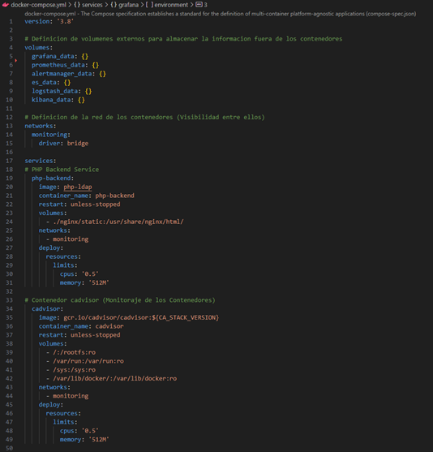
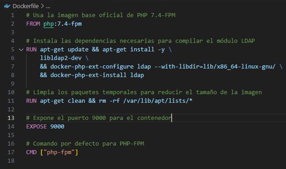
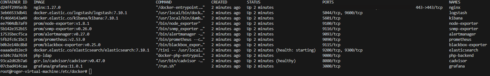

# Docker Commands

   


### Archivo docker-compose.yaml
##### Permite crear multiples contenedores con configuración personalizada



### Archivo Dockerfile

```
docker build –t  php-ldap
```



### Levantar contenedores

```
docker-compose up -d
```

### Levantar contenedores descargando una nueva versión de estos

```
docker-compose up -d --build
```

### Parar Contenedores

```
docker-compose stop 
```

```
docker-compose stop <nginx>
```

### Reiniciar contenedores

```
docker-compose restart 
```

```
docker-compose restart <nginx>
```

### Mostrar todos los contenedores (Cualquier Estado)

```
docker ps -a
```


### Logs Contenedores

```
docker logs –f nginx
```

### Exportar Logs 

```
docker logs -f nginx >& ./logs/nginx.log
```

## Imagenes Aplicaciones Contenedores

### Visualiza todas las imagenes descargadas localmente

```
docker images
```

### Eliminar imagen
```
docker image rm 
```
