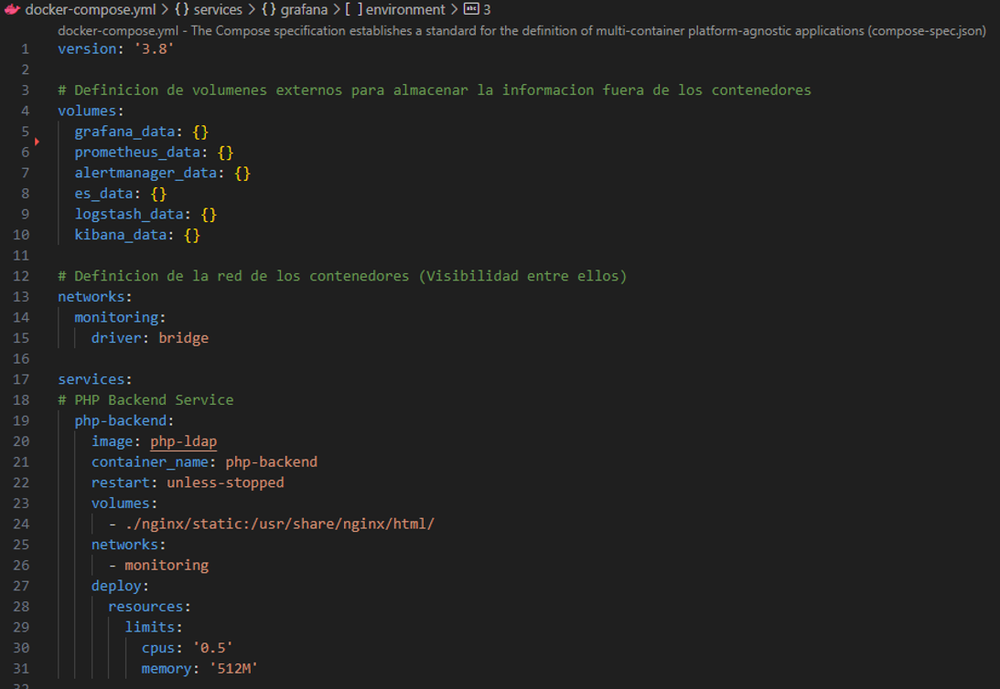
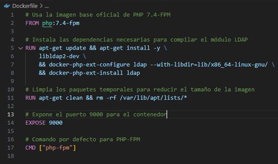
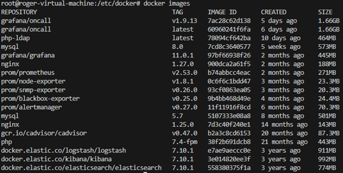
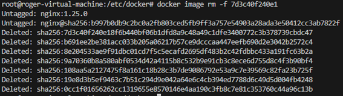

# Docker Commands

  


## ARCHIVOS
### docker-compose.yaml
<p>Permite crear multiples contenedores con configuración personalizada</p>



### Dockerfile


```
docker build –t  php-ldap
```

## Levantar contenedores

```
docker-compose up -d
```

<p>Levantar contenedores descargando una nueva versión de estos</p>

```
docker-compose up -d --build
```

## Parar Contenedores

```
docker-compose stop 
```

```
docker-compose stop nginx
```

## Reiniciar contenedores

```
docker-compose restart 
```

```
docker-compose restart nginx
```

## Mostrar todos los contenedores (Cualquier Estado)


```
docker ps -a
```

## Acceder internamente a un Contenedor

```
docker exec -it <CONTENEDOR> /bin/bash
```

## Logs

```
docker logs –f nginx
```

### Exportar Logs 

```
docker logs -f nginx >& ./logs/nginx.log
```

## Imagenes Contenedores

#### Muestra todas las imagenes descargadas localmente


```
docker images
```

#### Eliminar imagen



```
docker image rm -f <ID_IMAGEN>
```
