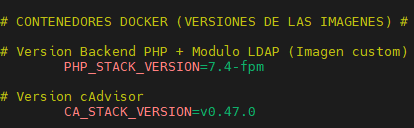

# Docker Commands

 


## ARCHIVOS RELEVANTES
### docker-compose.yaml 
<p>Archivo de configuración que permite definir múltiples servicios (contenedores) Docker en un único entorno. </p> 
<p>Permite describir contenedores, redes, volúmenes, recursos y variables de entorno necesarias para el funcionamiento de la aplicación, todo escrito en sintaxis YAML. Por lo que las extensiones que puede tener el archivo són .yaml / .yml </p>


### Dockerfile

<p>Es un archivo de texto que contiene una secuencia de instrucciones para crear una imagen personalizada, donde se define la construcción del contenedor, el software que incluye y cómo se configura. </p>

<p>En la imagen, podemos ver que partiendo de la imagen base de PHP 7.4, añadimos el módulo de autenticación LDAP. De este modo, crearemos una imagen personalizada que ya incluirá este módulo.</p>

```
docker build –t php-ldap
```

### .env 

<p>Archivo oculto que podemos usar para almacenar información sensible como credenciales, endpoints BBDD, API's, puertos, versiones de imagenes...) de esta manera evitaremos exponer los datos directamente en el codigo.</p> 



## Levantar contenedores

<p>Cuando ejecutamos docker-compose up -d se descargaran las imagenes de manera local con la version especificada o :latest en el caso que no lo hayamos hecho. </p>

```
docker-compose up -d
```

```
docker-compose up -d --build
```

<p>Si queremos usar una versión diferente para la imagen del contenedor, entonces debemos ejecutar docker-compose down, definir la nueva versión en el archivo y ejecutar docker-compose up -d añadiendo el flag--build al final del comando. </p>
<p>Todas las versiones disponibles las econtraremos en https://hub.docker.com</p>


## 

```
docker-compose down
```

## Parar Contenedores

```
docker-compose stop 
```

```
docker-compose stop nginx
```

## Reiniciar contenedores

```
docker-compose restart 
```

```
docker-compose restart nginx
```

## Mostrar todos los contenedores (Cualquier Estado)


```
docker ps -a
```

## Acceder directamente al contenedor

<p>La configuración de los contenedores se define mediante comandos específicos o a través del archivo docker-compose.yml. Por lo tanto, cualquier modificación debe realizarse siguiendo estos métodos para garantizar coherencia y reproducibilidad. </p>
<p>No es imprescindible acceder directamente al contenedor, pero es posible hacerlo mediante el siguiente comando: </p>

```
docker exec -it <CONTENEDOR> /bin/bash
```


## Logs

```
docker logs –f nginx
```

### Exportar Logs 

```
docker logs -f nginx >& ./logs/nginx.log
```

## Imagenes Contenedores

#### Muestra todas las imagenes descargadas localmente


```
docker images
```

#### Eliminar imagen


```
docker image rm -f <IMAGE_ID>
```
